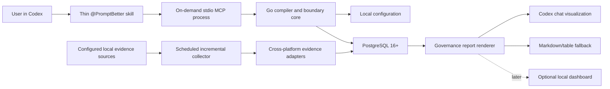

# Architecture

Frozen v1 interfaces, lifecycle states, compatibility rules, truth tables, and
stable errors are defined in [`contracts/architecture-v1.md`](contracts/architecture-v1.md).
Privacy and security controls are defined in [`privacy-model.md`](privacy-model.md)
and [`security-risk-model.md`](security-risk-model.md). Versioned schemas live
in `schemas/v1`.

## Principles

Prompt Better is a generic, project-agnostic compiler and risk-weighted boundary
engine. Codex remains the reasoning host. Prompt Better supplies deterministic
context discovery, prompt structure, policy checks, evidence normalization, and
governance reporting. It must not call a second LLM by default or replace Codex
permissions.

The Go core is cross-platform. macOS integration ships first through adapters;
platform-specific paths, scheduling, and process inspection never enter core
contracts.

## Components and lifecycle

The MCP server starts only when Codex invokes it and exits with its stdio
session. It performs interactive operations and bounded reads. It is not a
daemon, scheduler, or bulk ingestion worker.

The collector has an independent scheduled lifecycle. It uses per-source
watermarks, idempotent writes, bounded batches, and explicit configuration. A
collector failure must not prevent interactive prompt improvement. MCP shutdown
must not interrupt collection, and MCP startup must not trigger implicit scans.

## Interactive contracts

| Tool | Contract |
|---|---|
| `improve_prompt` | Compile intent into a bounded prompt with assumptions and gates. |
| `create_goal_prompt` | Render the house goal format and checkpoint obligations. |
| `create_review_fix_prompt` | Convert review findings into a failure-class remediation prompt. |
| `lint_prompt` | Return deterministic diagnostics without execution. |
| `get_checkpoint` | Return completed work, blocker, next actions, and remaining gates. |
| `audit_session` | Audit configured local evidence for one session/reference. |
| `audit_project` | Audit one bounded portfolio/project/task/trajectory window from normalized evidence. |
| `render_governance_report` | Render chat-native output or compact fallback. |

Contracts require versioned input/output schemas, stable error codes, redaction
metadata, and execution-policy results before implementations are accepted.

## Execution policy

- `improve_only`: return an improved prompt; never initiate execution.
- `ask_before_execute`: return the prompt and require explicit confirmation.
- `follow_user_intent`: preserve explicit user intent to plan or execute.

The effective policy is user-controlled configuration constrained by host
permissions. Prompt Better can require more confirmation but cannot grant access,
approve tools, bypass sandboxing, or broaden intent.

## Generic boundary discovery

Discovery operates through ordered policy packs and adapters, not repository
names. Candidate boundaries include repository roots, instruction files, current
branch/worktree, requested files/issues, declared non-goals, generated/vendor
areas, data classifications, and validation/release gates. Each boundary carries
source, confidence, precedence, risk, and explanation. Ambiguous high-risk
boundaries fail closed or request clarification according to execution policy.

## Evidence ingestion

Initial adapters normalize configured, local evidence from:

- Codex session JSONL;
- Codex `state_5.sqlite` metadata;
- Git and GitHub;
- Prompt Better and repository configuration;
- rollout summaries/Chronicle; and
- targeted process evidence when explicitly enabled and supported.

Sources are read-only. Adapters emit versioned envelopes with source kind,
source-local identity, observed time, content hash, classification, redaction
state, and cursor. Raw payloads are excluded unless a separate retention policy
explicitly permits them. Token measurements preserve provider/source semantics;
normalized deltas never pretend unlike counters are identical.

## Privacy boundaries

Session ingestion is local and opt-in/configured. Raw prompts are not retained by
default. Analytics stay local and remote telemetry is off by default. Source
access is least-privilege and bounded; reports aggregate and redact by default.
Deletes and retention are enforceable, auditable operations. Public fixtures are
synthetic. Optional future remote features require a new ADR and explicit consent.

## Failure isolation

Every adapter can be disabled independently. Unsupported or malformed evidence
is quarantined with sanitized diagnostics. Partial reports identify missing
sources without silently treating absence as compliance. Database unavailability
may disable audits, but deterministic prompt linting should remain usable when
its required local inputs are available.
