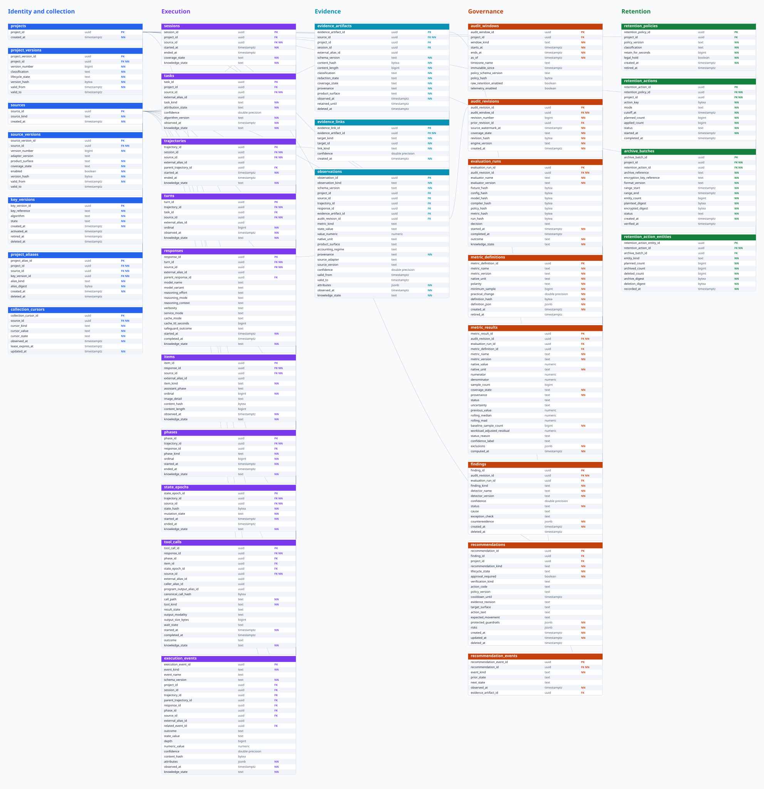
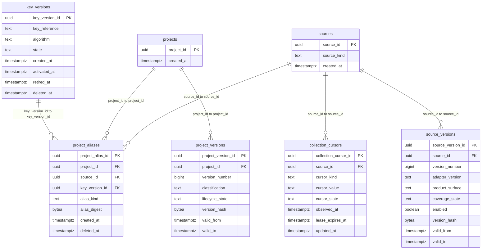
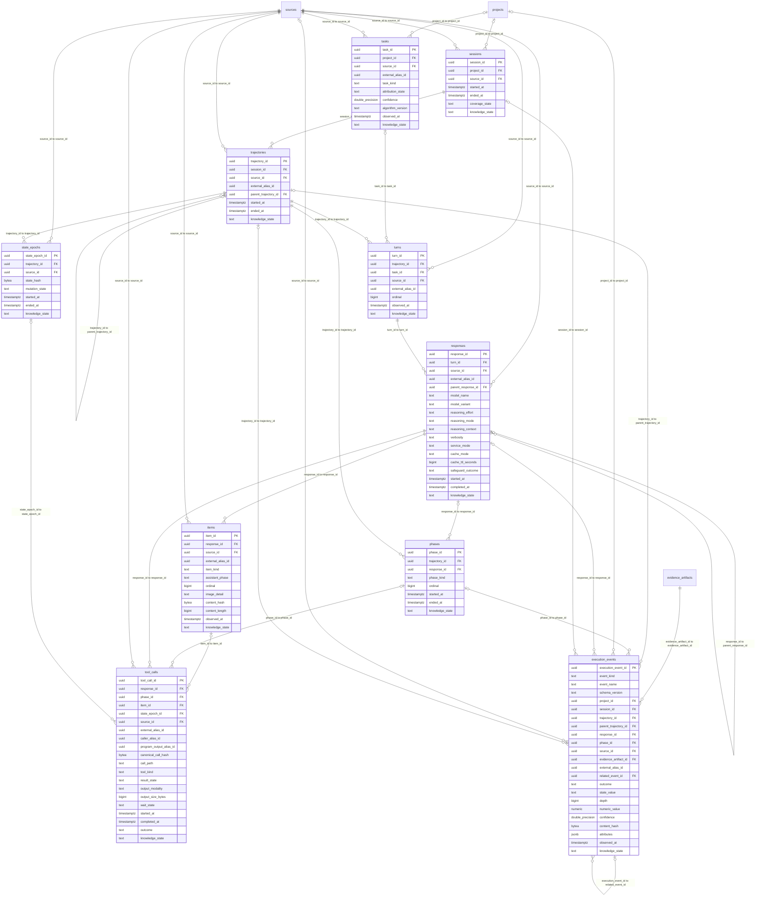
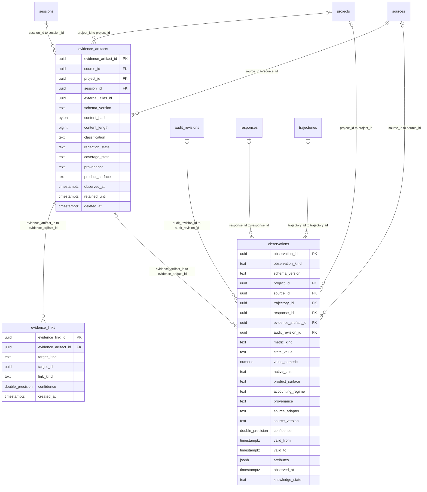
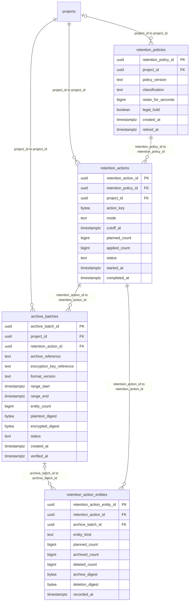

# Data model

PostgreSQL 16+ is the implemented operational and governance store. Migrations
and `docs/database.md` are authoritative for exact physical names.

## Architecture

This is a normalized relational operational model with dimensional read views.
It is not a star schema: execution, evidence, governance, and retention records
retain transactional integrity in third normal form, while views provide stable
analytics-facing projections. PostgreSQL remains the sole active store. Parquet
and Delta Lake are intentionally excluded from local transactional persistence;
they may be considered later only as optional export formats.

The physical baseline contains 32 tables. Polymorphic `execution_events` and
`observations` consolidate structurally similar facts without storing arbitrary
domain payloads. Typed kinds, checks, foreign keys, native units, provenance,
knowledge state, and evidence links preserve statistical meaning.

## Entity relationship diagram

GitHub renders this Mermaid diagram directly. Run
`go run ./scripts/generate-erd.go` after changing any migration. The generator
discovers every ordered migration up-section, including future tables and added
columns, but rewrites artifacts only when the physical ERD changes. The
pre-commit gate updates the same DBML, SVG, and generated Markdown block; CI
rejects drift and compares the result with the live PostgreSQL catalog.

<!-- BEGIN GENERATED ERD -->

_Generated from all ordered migration up-sections; schema fingerprint `4d77d11861a5`._

Open the SVG for a zoomable complete physical model, or edit/import [`data-model.dbml`](data-model.dbml) in a DBML-compatible editor. Both files are updated in place. The bounded diagrams below remain readable in GitHub.

### Identity and collection

### Execution

### Evidence

### Governance

```mermaid
erDiagram
    audit_windows {
        uuid audit_window_id PK
        uuid project_id FK
        text window_kind
        timestamptz starts_at
        timestamptz ends_at
        timestamptz as_of
        text timezone_name
        timestamptz immutable_since
        text policy_schema_version
        bytea policy_hash
        boolean raw_retention_enabled
        boolean telemetry_enabled
    }
    audit_revisions {
        uuid audit_revision_id PK
        uuid audit_window_id FK
        bigint revision_number
        uuid prior_revision_id FK
        timestamptz source_watermark_at
        text coverage_state
        bytea revision_hash
        text engine_version
        timestamptz created_at
    }
    evaluation_runs {
        uuid evaluation_run_id PK
        uuid audit_revision_id FK
        text evaluator_name
        text evaluator_version
        bytea fixture_hash
        bytea config_hash
        bytea model_hash
        bytea compiler_hash
        bytea policy_hash
        bytea metric_hash
        bytea run_hash
        text decision
        timestamptz started_at
        timestamptz completed_at
        text outcome
        text knowledge_state
    }
    metric_definitions {
        uuid metric_definition_id PK
        text metric_name
        text metric_version
        text native_unit
        text polarity
        bigint minimum_sample
        double_precision practical_change
        bytea definition_hash
        jsonb definition_json
        timestamptz created_at
        timestamptz retired_at
    }
    metric_results {
        uuid metric_result_id PK
        uuid audit_revision_id FK
        uuid evaluation_run_id FK
        uuid metric_definition_id FK
        text metric_name
        text metric_version
        numeric native_value
        text native_unit
        numeric numerator
        numeric denominator
        bigint sample_count
        text coverage_state
        text provenance
        text status
        text uncertainty
        numeric previous_value
        numeric rolling_median
        numeric rolling_mad
        bigint baseline_sample_count
        numeric workload_adjusted_residual
        text status_reason
        text confidence_label
        jsonb exclusions
        timestamptz computed_at
    }
    findings {
        uuid finding_id PK
        uuid audit_revision_id FK
        uuid evaluation_run_id FK
        text finding_kind
        text detector_name
        text detector_version
        double_precision confidence
        text status
        text cause
        text exception_check
        jsonb counterevidence
        timestamptz created_at
        timestamptz deleted_at
    }
    recommendations {
        uuid recommendation_id PK
        uuid audit_revision_id FK
        uuid finding_id FK
        uuid project_id FK
        text recommendation_kind
        text lifecycle_state
        boolean approval_required
        text verification_kind
        text action_code
        text policy_version
        timestamptz cooldown_until
        text evidence_revision
        text target_surface
        text action_text
        text expected_movement
        jsonb protected_guardrails
        jsonb risks
        timestamptz created_at
        timestamptz updated_at
        timestamptz deleted_at
    }
    recommendation_events {
        uuid recommendation_event_id PK
        uuid recommendation_id FK
        text event_kind
        text prior_state
        text next_state
        timestamptz observed_at
        uuid evidence_artifact_id FK
    }
    audit_windows ||--o{ audit_revisions : "audit_window_id to audit_window_id"
    audit_revisions o|--o{ audit_revisions : "audit_revision_id to prior_revision_id"
    projects o|--o{ audit_windows : "project_id to project_id"
    audit_revisions ||--o{ evaluation_runs : "audit_revision_id to audit_revision_id"
    audit_revisions ||--o{ findings : "audit_revision_id to audit_revision_id"
    evaluation_runs o|--o{ findings : "evaluation_run_id to evaluation_run_id"
    audit_revisions ||--o{ metric_results : "audit_revision_id to audit_revision_id"
    evaluation_runs o|--o{ metric_results : "evaluation_run_id to evaluation_run_id"
    metric_definitions o|--o{ metric_results : "metric_definition_id to metric_definition_id"
    evidence_artifacts o|--o{ recommendation_events : "evidence_artifact_id to evidence_artifact_id"
    recommendations ||--o{ recommendation_events : "recommendation_id to recommendation_id"
    audit_revisions ||--o{ recommendations : "audit_revision_id to audit_revision_id"
    findings o|--o{ recommendations : "finding_id to finding_id"
    projects o|--o{ recommendations : "project_id to project_id"
```

### Retention

<!-- END GENERATED ERD -->

## Migration discipline

All persisted changes use immutable, versioned migrations. For each migration
sequence: create types/extensions when justified, then tables, then indexes,
foreign keys, and views. Never create an index, FK, or view before its referenced
tables. Migrations need forward, rollback/repair, empty-database, upgrade, and
restore validation. Runtime code must not create schema ad hoc.

## Identity and joins

Internal primary keys are UUIDs generated by Prompt Better. Natural identifiers
remain scoped to a source and are unique as `(source_id, external_id)`. All
timestamps are `timestamptz` in UTC. Content-based deduplication uses a versioned
canonicalization algorithm plus SHA-256 hash. Nullable joins must preserve
unmatched evidence rather than invent relationships.

| Entity | Purpose | Principal joins |
|---|---|---|
| `projects` | Configured project boundary. | `project_id` to sessions, policies, reports. |
| `sources` | Evidence adapter/config identity. | `source_id` to cursors and artifacts. |
| `collection_cursors` | Per-source incremental watermark and lease. | unique `source_id + cursor_kind`. |
| `sessions` | Normalized Codex execution session metadata. | `project_id`; external identity through source refs. |
| `tasks` | Opaque normalized task identity and attribution state. | project/source; turns. |
| `state_epochs` | Redacted state-change boundary for repeat classification. | trajectory/source; tool calls. |
| `execution_events` | Typed delegation, compaction, stop, checkpoint, boundary, plan, budget, policy, and capability facts. | evidence/project/session/trajectory/response/phase/source. |
| `tool_calls` | Sanitized tool metadata and state outcome. | response, source, state epoch. |
| `evidence_artifacts` | Normalized envelope and classification. | `source_id`; optional project/session. |
| `evidence_links` | Typed many-to-many provenance links. | artifact to target entity, with confidence. |
| `observations` | Typed usage, cache, confounder, governance, attribution, and source assertions. | trajectory/response/artifact/audit/source. |
| `metric_definitions` / `metric_results` | Versioned formulas and transparent results. | audit revision/evaluation; evidence through typed links. |
| `audit_windows` / `audit_revisions` | Bounded immutable audit window and revision. | project/policy/watermark. |
| `findings` / `recommendations` | Evidence-backed diagnosis and preview-only action lifecycle, retained as one audit-revision unit. | audit revision/evaluation/project. |
| `retention_actions` / `retention_action_entities` | Auditable archive/deletion outcome. | policy, project, archive batch, affected entity class. |

## Sensitive content

Raw prompt bodies and raw source payloads have no default storage column. The
default stores hashes, lengths, classifications, diagnostics, and derived facts.
Any future raw-content table requires a separate migration, explicit opt-in
policy, encryption and deletion design, access audit, security-risk-model
update, and ADR. Secrets must never be stored.

## Views

Views expose project/session coverage, collection freshness, trajectory usage,
tool-loop summaries, token deltas, and governance trends. Views must use normalized tables, preserve
unknown/missing states, document denominator rules, and avoid re-identifying
redacted data. Materialized views, if added, need explicit refresh ownership.

## Retention and recovery

Retention applies by classification, source, project, and age with dry-run and
auditable counts. Deletion follows dependency order and respects legal/user holds.
Backup/restore documentation must cover schema version, encryption, least
privilege, integrity verification, and a tested restore into an isolated database.
